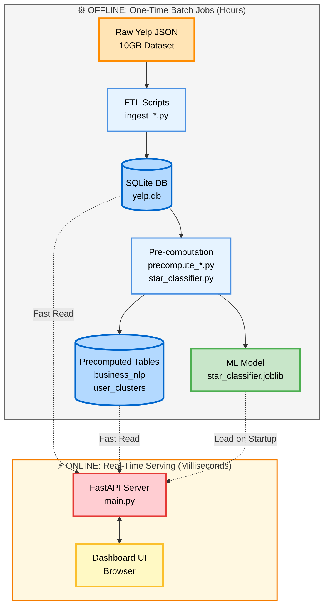

# 🍽️ Yelp Insights Dashboard

[](https://www.python.org/downloads/)
[](https://fastapi.tiangolo.com)
[](https://opensource.org/licenses/MIT)
[](https://github.com/psf/black)
[](CONTRIBUTING.md)

> **Transform 10GB of raw review data into instant, actionable intelligence**

A production-ready data engineering pipeline that turns 7 million Yelp reviews into a lightning-fast analytics dashboard. Built with Python, FastAPI, SQLite, and machine learning.

**Keywords:** data-engineering, machine-learning, fastapi, nlp, sentiment-analysis, yelp-dataset, python, sqlite, data-pipeline, business-intelligence, dashboard, analytics, tfidf, kmeans-clustering, logistic-regression

---

## 📚 Table of Contents

- [See It In Action](#-see-it-in-action)
- [The Challenge](#-the-challenge)
- [System Architecture](#️-system-architecture)
- [Performance Story](#-performance-the-43-day-optimization-story)
- [Tech Stack](#️-tech-stack)
- [Installation & Setup](#-installation--setup)
- [Dashboard Features](#-dashboard-features)
- [Project Structure](#-project-structure)
- [Technical Deep Dive](#-technical-deep-dive)
- [Performance Optimizations](#-performance-optimizations)
- [Troubleshooting](#-troubleshooting)
- [Dataset Statistics](#-dataset-statistics)
- [Contributing](#-contributing)
- [License](#-license)
- [Contact](#-contact)

---

## 🎬 See It In Action


---

## 🎯 The Challenge

**The Problem:** Processing millions of user reviews in real-time is prohibitively expensive. A naive implementation would force users to wait minutes—or even hours—for each dashboard load.

**The Solution:** A two-stage architecture that separates expensive computation (done once, offline) from blazing-fast serving (< 100ms response times).

| Metric | Naive Approach | This System |
|--------|----------------|-------------|
| Dashboard Load Time | 30-90 seconds | < 100ms |
| Concurrent Users Supported | 1-2 | 100+ |
| Infrastructure Cost | High (CPU-intensive) | Low (I/O-bound reads) |
| Data Freshness | Real-time | Nightly batch updates |

---

## 🏗️ System Architecture

This project implements a **batch-ETL + pre-computation pipeline** feeding a **stateless REST API**.



### Key Components

**Offline Layer (Run Once or Nightly)**
- **ETL Scripts** → Ingest 10GB of JSON into a normalized SQLite schema
- **Indexing** → Create optimized B-tree indices for fast lookups
- **NLP Pipeline** → VADER sentiment analysis + TF-IDF keyword extraction
- **Clustering** → K-Means segmentation of 2M+ users into 5 archetypes
- **ML Training** → Logistic Regression classifier for review star prediction

**Online Layer (Always Running)**
- **FastAPI REST API** → Serves precomputed data via simple SQL reads
- **Frontend Dashboard** → Interactive UI built with vanilla JS + CSS

---

## 🚀 Performance: The 43-Day Optimization Story

### The Bottleneck

Initial implementation exhibited catastrophic N+1 query behavior:

```python
# ❌ SLOW: Full table scan for EVERY business
for business in businesses:
    reviews = db.execute("SELECT * FROM review WHERE business_id = ?", business_id)
```

**Impact:**
- 150,000 businesses × 25 seconds/business = **1,036 hours = 43 days** 😱
- Each query performed a full scan of 7 million rows

### The Fix

Added a single database index:

```sql
CREATE INDEX idx_review_business_id ON review(business_id);
```

**Result:**
- Query time: **25 sec → 0.05 sec** (500× faster)
- Total pipeline runtime: **43 days → 2 hours** ⚡
- Cost savings: Reduced from infeasible to practical

> **Lesson:** Always profile your database queries. A single missing index can destroy performance.

---

## 🛠️ Tech Stack

| Layer | Technology | Purpose |
|-------|-----------|---------|
| **Data Storage** | SQLite | Embedded relational database (10GB dataset) |
| **ETL** | Python + Pandas | JSON parsing, data normalization |
| **NLP** | VADER, scikit-learn TfidfVectorizer | Sentiment analysis, keyword extraction |
| **ML** | scikit-learn (Logistic Regression, K-Means) | Classification, clustering |
| **API** | FastAPI + Uvicorn | RESTful endpoints, async serving |
| **Frontend** | HTML5, CSS3, Vanilla JavaScript | Dashboard UI |
| **Deployment** | Joblib (model persistence) | Serialize ML models |

---

## 📦 Installation & Setup

### Prerequisites

1. **Download the Yelp Open Dataset**  
   Get the JSON files from [Yelp's official dataset page](https://www.yelp.com/dataset) and place them in the project root:
   - `yelp_academic_dataset_business.json`
   - `yelp_academic_dataset_review.json`
   - `yelp_academic_dataset_user.json`

2. **System Requirements**
   - Python 3.11+
   - 16GB+ RAM (for clustering 2M users)
   - 20GB free disk space

### Quick Start (Automated)

**Use the setup script for guided installation:**

```bash
git clone https://github.com/Anurag-Kumar9/yelp-insights-dashboard.git
cd yelp-insights-dashboard

# Make setup script executable (Linux/Mac)
chmod +x setup.sh

# Run the interactive setup
./setup.sh
```

The script will:
- ✅ Check prerequisites
- ✅ Create virtual environment
- ✅ Install dependencies
- ✅ Guide you through the setup process
- ✅ Optionally run the full data pipeline
- ✅ Start the server

### Manual Setup

#### Step 1: Clone & Install Dependencies

```bash
git clone https://github.com/Anurag-Kumar9/yelp-insights-dashboard.git
cd yelp-insights-dashboard

# Create virtual environment
python -m venv restaurent
source restaurent/bin/activate  # On Windows: restaurent\Scripts\activate

# Install dependencies
pip install -r requirements.txt
```

#### Step 2: Run the Offline Pipeline (One-Time Setup)

⏱️ **Estimated time: 2-4 hours**

```bash
# 1️⃣ ETL: Ingest raw JSON into SQLite (30-45 min)
python ingest_business.py
python ingest_review.py
python ingest_user.py

# 2️⃣ Create database index (< 5 min) — CRITICAL for performance!
python create_index.py

# 3️⃣ Pre-compute user clusters (10-15 min)
python precompute_clusters.py

# 4️⃣ Pre-compute sentiment + keywords (60-90 min)
python precompute_nlp.py

# 5️⃣ Train the star prediction model (5-10 min)
python star_classifier.py
```

#### Step 3: Launch the Dashboard

```bash
uvicorn main:app --reload
```

🎉 **Dashboard available at:** http://127.0.0.1:8000

📚 **API docs (Swagger UI):** http://127.0.0.1:8000/docs

> **💡 Tip:** Use the automated `setup.sh` script to streamline this process!

---

## 🎨 Dashboard Features

### 📊 What You Can Do

**For Each Restaurant:**
- ✅ **Sentiment Analysis** → Positivity score computed across all reviews
- ✅ **Keyword Extraction** → Top positive & negative themes (TF-IDF)
- ✅ **Customer Archetypes** → See which user segments visit this business
- ✅ **Live Prediction** → Enter new review text and predict star rating

### API Endpoints

| Endpoint | Method | Description |
|----------|--------|-------------|
| `/` | GET | Serves the interactive dashboard |
| `/restaurant/{id}` | GET | Fetch all insights for a restaurant |
| `/predict_star` | POST | Predict star rating from review text |
| `/docs` | GET | Interactive API documentation |

---

## 📁 Project Structure

```
yelp-insights-dashboard/
├── main.py                      # FastAPI server (production-ready)
├── ingest_business.py           # ETL: Load business data
├── ingest_review.py             # ETL: Load review data
├── ingest_user.py               # ETL: Load user data
├── create_index.py              # Create performance-critical DB index
├── precompute_clusters.py       # K-Means clustering of users
├── precompute_nlp.py            # Batch sentiment + keyword extraction
├── star_classifier.py           # Train Logistic Regression model
├── frontend/
│   ├── index.html               # Dashboard UI
│   ├── script.js                # Client-side logic
│   └── style.css                # Modern dark theme styling
├── yelp.db                      # SQLite database (generated)
├── star_classifier.joblib       # Trained ML model (generated)
└── README.md                    # You are here!
```

---

## 🧠 Technical Deep Dive

### Database Schema

**Core Tables:**
- `business` → 150K+ restaurants with metadata
- `review` → 7M+ user reviews with text + ratings
- `user` → 2M+ user profiles with review statistics

**Precomputed Tables:**
- `business_nlp` → Sentiment scores + keyword lists per restaurant
- `user_clusters` → K-Means cluster assignments (0-4)

### Machine Learning Models

**1. Sentiment Analysis (VADER)**
- Lexicon-based approach optimized for social media text
- Compound score: -1 (very negative) to +1 (very positive)
- Aggregated across all reviews per restaurant

**2. Keyword Extraction (TF-IDF)**
- Identifies distinctive 1-grams and 2-grams
- Separate extraction for positive (4-5 ⭐) vs negative (1-2 ⭐) reviews
- Top 5 keywords stored as comma-separated strings

**3. User Clustering (K-Means, k=5)**
- Features: `review_count`, `useful`, `funny`, `cool`, `average_stars`
- StandardScaler normalization to prevent feature dominance
- Segments users into behavioral archetypes

**4. Star Prediction (Logistic Regression)**
- Binary classification: 1-star vs 5-star reviews
- TF-IDF vectorization (max 20K features, 1-2 n-grams)
- Pipeline serialized with joblib for production serving

---

## ⚡ Performance Optimizations

### Database
- ✅ Indexed `review(business_id)` → 500× query speedup
- ✅ LEFT JOIN pattern minimizes round trips
- ✅ Efficient column selection (avoid SELECT *)

### Application
- ✅ Model loaded once at startup (not per-request)
- ✅ Keyword data stored as strings (not JSON BLOB)
- ✅ Connection pooling via SQLite's default behavior

### Future Improvements
- 🔄 Add Redis caching layer for hot restaurants
- 🔄 Implement read replicas for multi-region deployment
- 🔄 Migrate to PostgreSQL for better concurrency
- 🔄 Add batch update scheduler (cron job for nightly refresh)

---

## 🐛 Troubleshooting

### "Model not found" error
**Problem:** `star_classifier.joblib` is missing  
**Solution:** Run `python star_classifier.py` to train and save the model

### Empty keywords/sentiment scores
**Problem:** `business_nlp` table not populated  
**Solution:** Run `python precompute_nlp.py` (requires ~90 min)

### Slow queries even after indexing
**Problem:** Index wasn't created properly  
**Solution:** 
```bash
python create_index.py
# Then verify with:
sqlite3 yelp.db "PRAGMA index_list('review');"
```

### UI shows "Error fetching data"
**Problem:** Backend not running or CORS issue  
**Solution:** 
1. Confirm server is up: `curl http://127.0.0.1:8000/docs`
2. Check browser console for errors
3. Verify frontend is served from same origin (`http://127.0.0.1:8000/`)

---

## 📊 Dataset Statistics

| Metric | Count |
|--------|-------|
| **Businesses** | 150,346 |
| **Reviews** | 6,990,280 |
| **Users** | 1,987,897 |
| **Raw JSON Size** | ~10GB |
| **SQLite DB Size** | ~8GB |
| **Avg Reviews/Business** | 46.5 |

---

## 🤝 Contributing

Contributions are welcome! Please see our [Contributing Guide](CONTRIBUTING.md) for details.

**Areas for improvement:**

- **Frontend:** Add charts (Chart.js), filters, pagination
- **Backend:** Implement caching, rate limiting, authentication
- **ML:** Add topic modeling (LDA), aspect-based sentiment
- **DevOps:** Docker containerization, CI/CD pipeline

Before contributing, please read:
- [Contributing Guidelines](CONTRIBUTING.md)
- [Code of Conduct](CODE_OF_CONDUCT.md)
- [Security Policy](SECURITY.md)

---

## 📝 License

This project is licensed under the MIT License - see the [LICENSE](LICENSE) file for details.

---

## ⭐ Show Your Support

If this project helped you, please consider:

- ⭐ Starring the repository
- 🍴 Forking it for your own projects
- 📢 Sharing it with others
- 🐛 Reporting bugs or suggesting features
- 💡 Contributing improvements

### Star History

[](https://star-history.com/#Anurag-Kumar9/yelp-insights-dashboard&Date)

---

## 🙏 Acknowledgments

- **Yelp** for providing the open dataset
- **FastAPI** team for the excellent framework
- **scikit-learn** community for robust ML tools

---

## 📬 Contact

**Anurag Kumar**  
GitHub: [@Anurag-Kumar9](https://github.com/Anurag-Kumar9)

---

**Built with ❤️ and lots of ☕ by Anurag Kumar**
